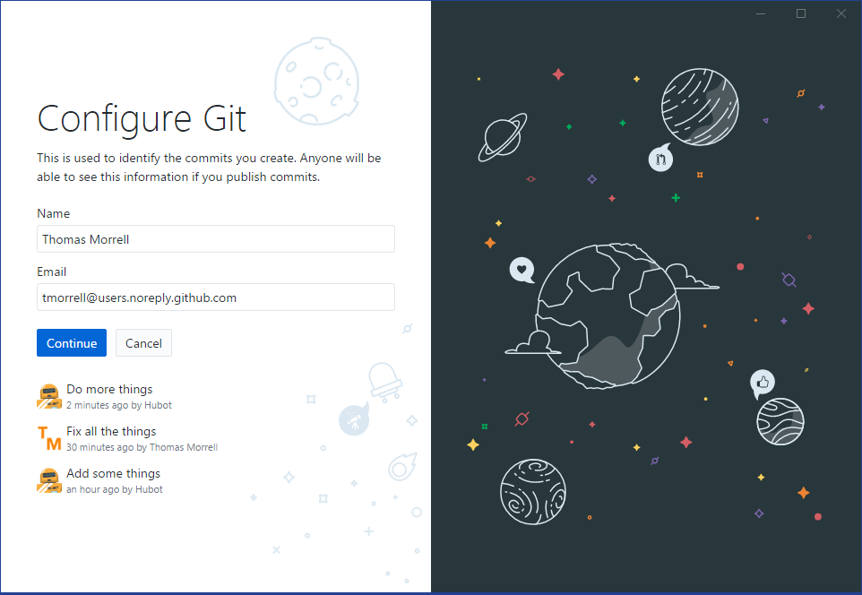

When we use GitHub Desktop on a new computer for the first time,
we need to configure a few things.

You'll see a welcome screen when you open GitHub Desktop.  Click 
"Sign in to GitHub.com" enter your GitHub username and password.  

You do not need a 
GitHub account to use GitHub Desktop (It's an open source program and
works even if you don't have a GitHub account - you could click on 
"Skip this step" on the welcome screen).  However, because we're 
going to be syncing repositories with GitHub later on in this lesson 
it makes sense to sign in now.

Next, we'll set our name and email address for Git.  A requirement of 
the Git version control system is that you set a name and email address.
These will be included with the history of changes made to a repository.

While this name and email doesn't need to be the same as the one in your
GitHub account, it's easier if they match.  Note that the default email from
GitHub is @users.noreply.github.com - this is a private address that is connected
to your GitHub account.  It doesn't accept email and ensures privacy. 

These configuration changes don't have to be added next time you start GitHub Desktop, but
can be modified under Preferences/Accounts and Preferences/Git.
