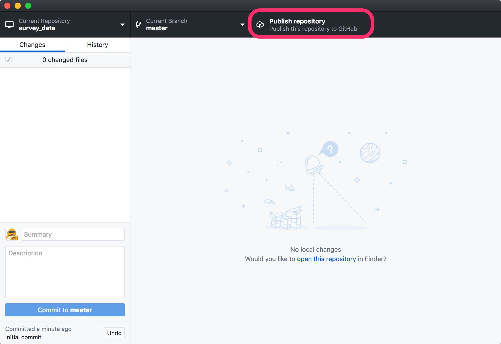
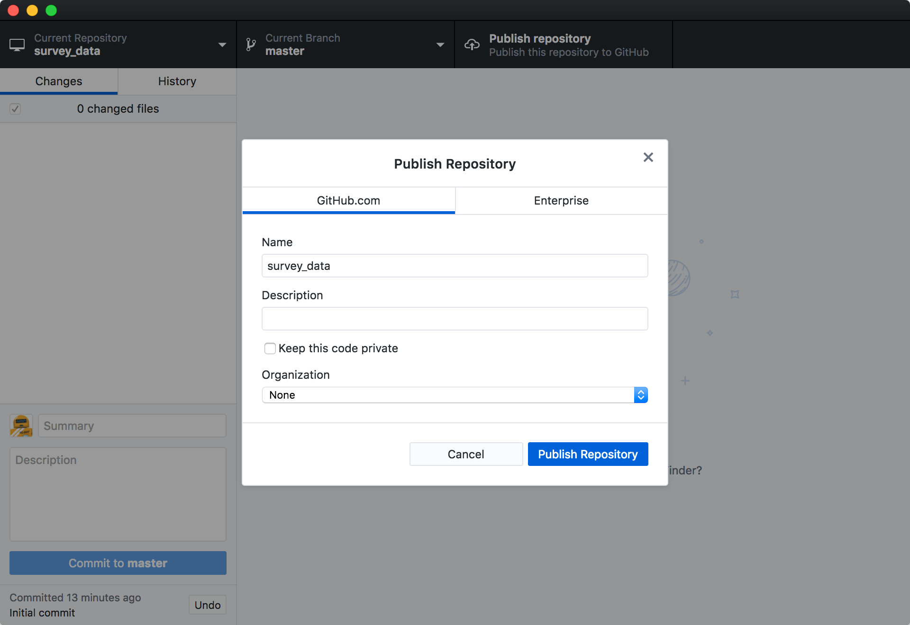
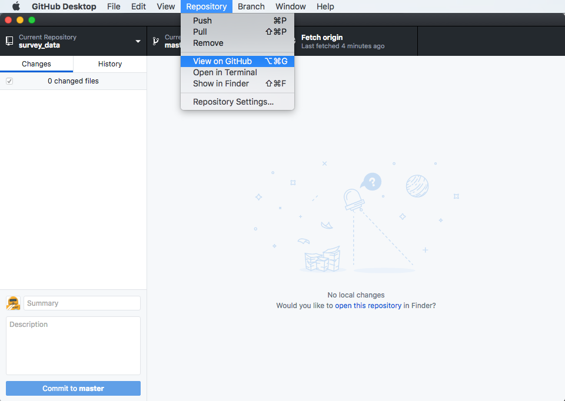
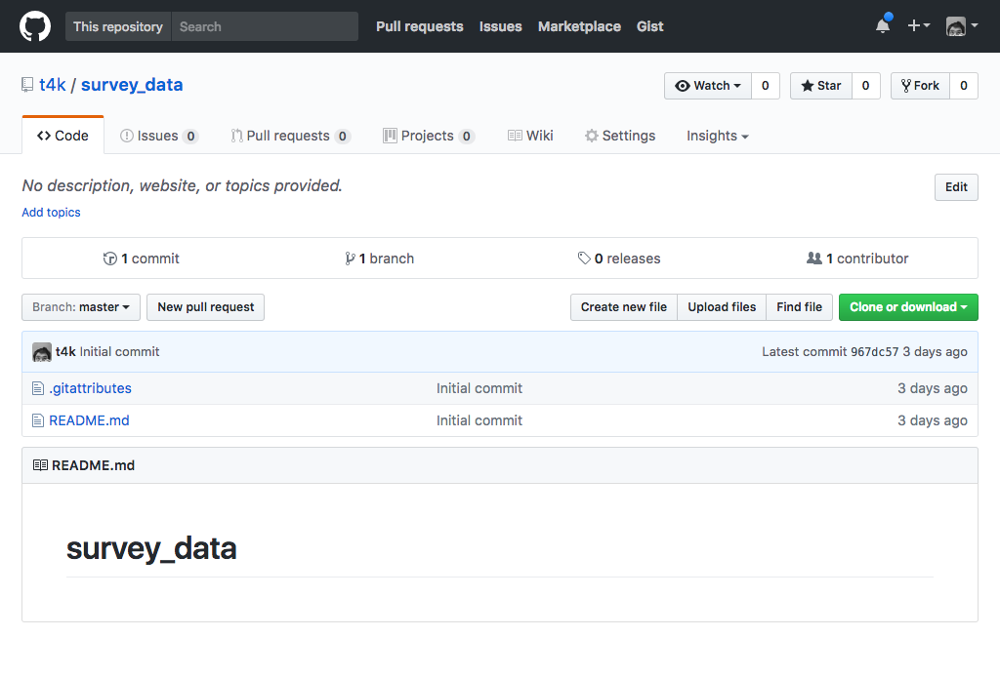
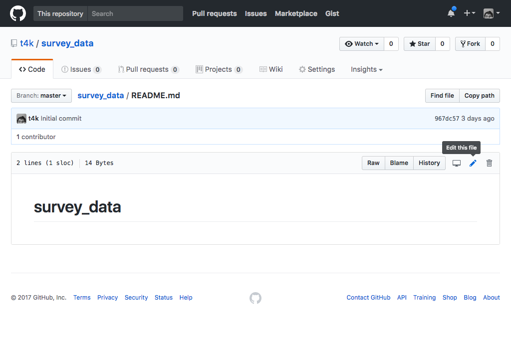
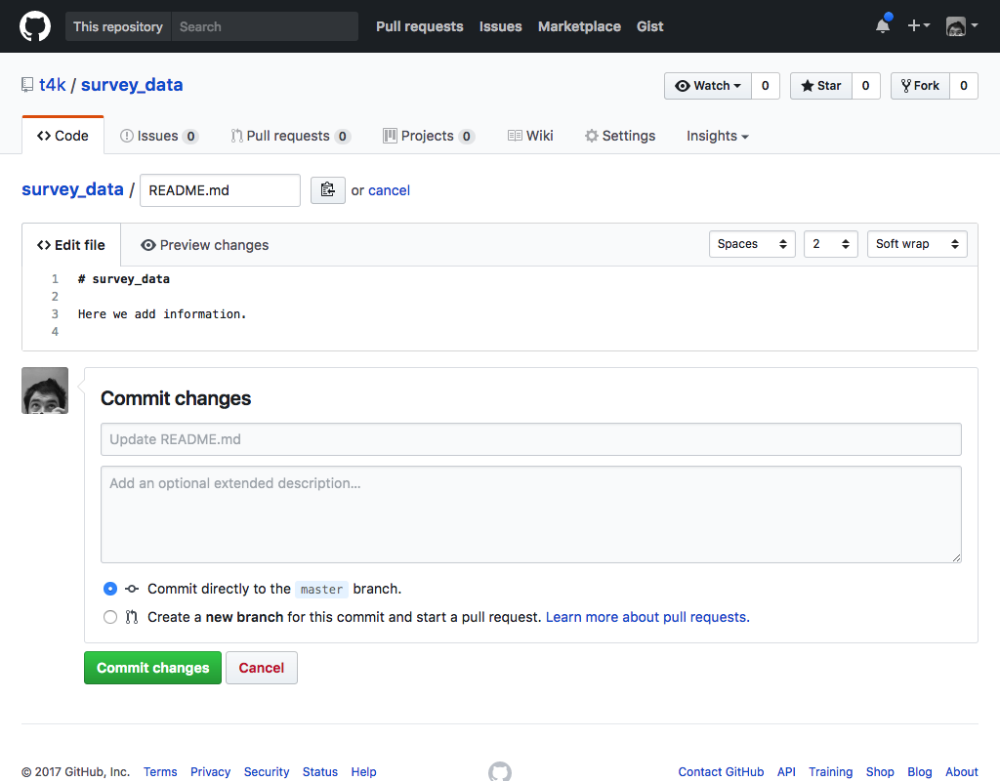
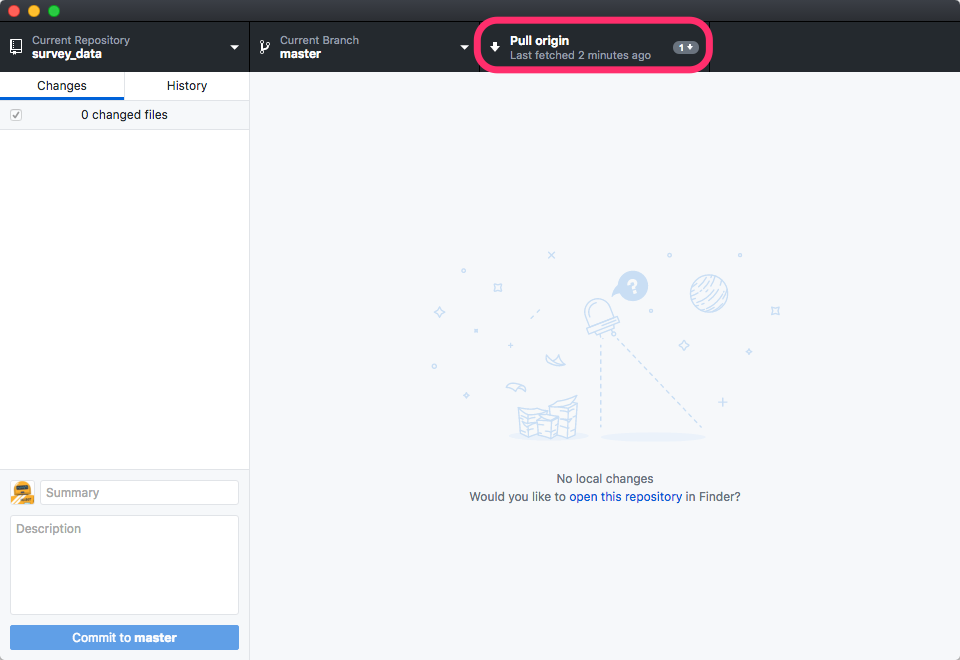

Version control really comes into its own when we begin to collaborate with
other people.  We already have most of the machinery we need to do this; the
only thing missing is to copy changes from one repository to another.

Systems like Git allow us to move work between any two repositories.  In
practice, though, it's easiest to use one copy as a central hub, and to keep it
on the web rather than on someone's laptop.  Most programmers use hosting
services like [GitHub](http://github.com), [BitBucket](http://bitbucket.org) or
[GitLab](http://gitlab.com/) to hold those master copies. Since we are using the
GitHub Desktop software for this workshop, we'll be using the GitHub service.

Let's start by sharing the changes we've made to our current project with the
world. From the GitHub Desktop window, simply click the Publish Repository tab
at the top.



On the pop-up window make sure the GitHub.com tab is selected and then uncheck
the "Keep this code private" checkbox. Feel free to add a Description as well.



Now we can view the repository on GitHub itself. Open the Repository menu and
select View on GitHub.



We'll then see our repository on GitHub:



A feature of having a repository hosted remotely is that changes can be made to
it from beyond the local machine you started with. Let's make some changes to
the repository on GitHub itself and then pull them back into our local copy.

Click the link to the `README.md` file and then click the edit pencil on the
right side of the file header.



Add some text to the file and then click the Commit Changes button at the
bottom of the page. It is a good idea to change the subject and description of
the commit message, but we can accept the defaults on this occasion.



If we go back to the GitHub Desktop application we will see a change in the
interface. Where it once said Publish Repository (or Fetch Origin) it now says
Pull Origin with a number by it. This indicates that a number of commits have
been made to the repository that we do not have in our local copy. Click the tab
to pull the changes locally.



If you click the History tab in GitHub Desktop you will see the latest commit
made from the web is now included in the repository.

> ## GitHub GUI
>
> Browse to your `survey_data` repository on GitHub.
> Under the Code tab, find and click on the text that says "XX commits" (where "XX" is some number).
> Hover over, and click on, the three buttons to the right of each commit.
> What information can you gather/explore from these buttons?
> How would you get that same information in the shell?
>
> > ## Solution
> > The left-most button (with the picture of a clipboard) copies the full identifier of the commit to the clipboard. In the shell, ```git log``` will show you the full commit identifier for each commit.
> >
> > When you click on the middle button, you'll see all of the changes that were made in that particular commit. Green shaded lines indicate additions and red ones removals. In the shell we can do the same thing with ```git diff```. In particular, ```git diff ID1..ID2``` where ID1 and ID2 are commit identifiers (e.g. ```git diff a3bf1e5..041e637```) will show the differences between those two commits.
> >
> > The right-most button lets you view all of the files in the repository at the time of that commit. To do this in the shell, we'd need to checkout the repository at that particular time. We can do this with ```git checkout ID``` where ID is the identifier of the commit we want to look at. If we do this, we need to remember to put the repository back to the right state afterwards!
> {: .solution}
{: .challenge}

> ## Push vs. Commit
>
> In this lesson, we introduced the "git push" command.
> How is "git push" different from "git commit"?
>
> > ## Solution
> > When we push changes, we're interacting with a remote repository to update it with the changes we've made locally (often this corresponds to sharing the changes we've made with others). Commit only updates your local repository.
> {: .solution}
{: .challenge}

> ## Fixing Remote Settings
>
> It happens quite often in practice that you made a typo in the
> remote URL. This exercice is about how to fix this kind of issues.
> First start by adding a remote with an invalid URL:
>
> ~~~
> git remote add broken https://github.com/this/url/is/invalid
> ~~~
> {: .bash}
>
> Do you get an error when adding the remote? Can you think of a
> command that would make it obvious that your remote URL was not
> valid? Can you figure out how to fix the URL (tip: use `git remote
> -h`)? Don't forget to clean up and remove this remote once you are
> done with this exercise.
>
> > ## Solution
> > We don't see any error message when we add the remote (adding the remote tells git about it, but doesn't try to use it yet). As soon as we try to use ```git push``` we'll see an error message. The command ```git remote set-url``` allows us to change the remote's URL to fix it.
> {: .solution}
{: .challenge}

> ## GitHub License and README files
>
> In this section we learned about creating a remote repository on GitHub, but when you initialized your
> GitHub repo, you didn't add a README.md or a license file. If you had, what do you think would have happened when
> you tried to link your local and remote repositories?
>
> > ## Solution
> > In this case, since we already had a README file in our own (local) repository, we'd see a merge conflict (when git realises that there are two versions of the file and asks us to reconcile the differences).
> {: .solution}
{: .challenge}
