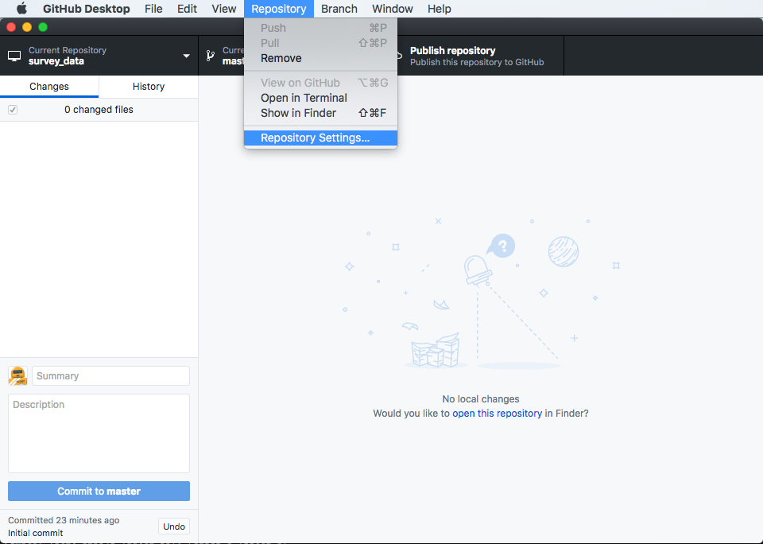
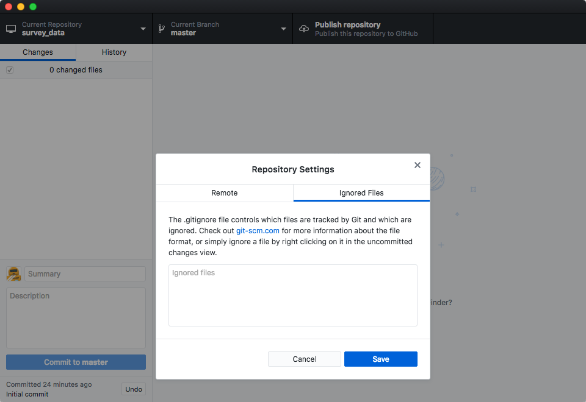

While we did say that ignoring files was outside the scope of this workshop and
we skipped including a Git ignore file when creating the repository, we'll touch
on it here.

What if we have files that we do not want Git to track for us,
like backup files created by our editor
or intermediate files created during data analysis.

To ignore files in your repository with GitHub Desktop go to the Repository menu
and select Repository Settings…

With the Repository Settings pop-up open, click the Ignored Files tab. Here you
will be able to add file names, directory names, or patterns for Git to ignore
in your repository.

If you want to follow along, add `.DS_Store` to the list, which a common macOS
hidden system file that often is accidentally added to repositories.

You will notice a new change has been staged for the repository because the Git
ignore file did not exist before. The hidden .gitignore file is how Git tracks
which files to not track. You'll need to add it to the repository to make sure
you continually ignore those files.

This is as much as we'll cover in this section, but take a look at the tips
below if you want more information.

> ## Ignoring Nested Files
>
> Given a directory structure that looks like:
>
> ~~~
> results/data
> results/plots
> ~~~
> {: .bash}
>
> How would you ignore only `results/plots` and not `results/data`?
>
> > ## Solution
> >
> > As with most programming issues, there are a few ways that you
> > could solve this. If you only want to ignore the contents of
> > `results/plots`, you can change your `.gitignore` to ignore
> > only the `/plots/` subfolder by adding the following line to
> > your .gitignore:
> >
> > `results/plots/`
> >
> > If, instead, you want to ignore everything in `/results/`, but wanted to track
> > `results/data`, then you can add `results/` to your .gitignore
> > and create an exception for the `results/data/` folder.
> > The next challenge will cover this type of solution.
> >
> > Sometimes the `**` pattern comes in handy, too, which matches
> > multiple directory levels. E.g. `**/results/plots/*` would make git ignore
> > the `results/plots` directory in any root directory.
> {: .solution}
{: .challenge}

> ## Including Specific Files
>
> How would you ignore all `.data` files in your root directory except for
> `final.data`?
> Hint: Find out what `!` (the exclamation point operator) does
>
> > ## Solution
> >
> > You would add the following two lines to your .gitignore:
> >
> > ~~~
> > *.data           # ignore all data files
> > !final.data      # except final.data
> > ~~~
> > {: .output}
> >
> > The exclamation point operator will include a previously excluded entry.
> {: .solution}
{: .challenge}

> ## Ignoring all data Files in a Directory
>
> Given a directory structure that looks like:
>
> ~~~
> results/data/position/gps/a.data
> results/data/position/gps/b.data
> results/data/position/gps/c.data
> results/data/position/gps/info.txt
> results/plots
> ~~~
> {: .bash}
>
> What's the shortest `.gitignore` rule you could write to ignore all `.data`
> files in `result/data/position/gps`? Do not ignore the `info.txt`.
>
> > ## Solution
> >
> > Appending `results/data/position/gps/*.data` will match every file in `results/data/position/gps` that ends with `.data`.
> > The file `results/data/position/gps/info.txt` will not be ignored.
> {: .solution}
{: .challenge}

> ## The Order of Rules
>
> Given a `.gitignore` file with the following contents:
>
> ~~~
> *.data
> !*.data
> ~~~
> {: .bash}
>
> What will be the result?
>
> > ## Solution
> >
> > The `!` modifier will negate an entry from a previously defined ignore pattern.
> > Because the `!*.data` entry negates all of the previous `.data` files in the `.gitignore`,
> > none of them will be ignored, and all `.data` files will be tracked.
> >
> {: .solution}
{: .challenge}

> ## Log Files
>
> You wrote a script that creates many intermediate log-files of the form `log_01`, `log_02`, `log_03`, etc.
> You want to keep them but you do not want to track them through `git`.
>
> 1. Write **one** `.gitignore` entry that excludes files of the form `log_01`, `log_02`, etc.
>
> 2. Test your "ignore pattern" by creating some dummy files of the form `log_01`, etc.
>
> 3. You find that the file `log_01` is very important after all, add it to the tracked files without changing the `.gitignore` again.
>
> 4. Discuss with your neighbor what other types of files could reside in your directory that you do not want to track and thus would exclude via `.gitignore`.
>
> > ## Solution
> >
> > 1. append either `log_*`  or  `log*`  as a new entry in your .gitignore
> > 3. track `log_01` using   `git add -f log_01`
> {: .solution}
{: .challenge}
