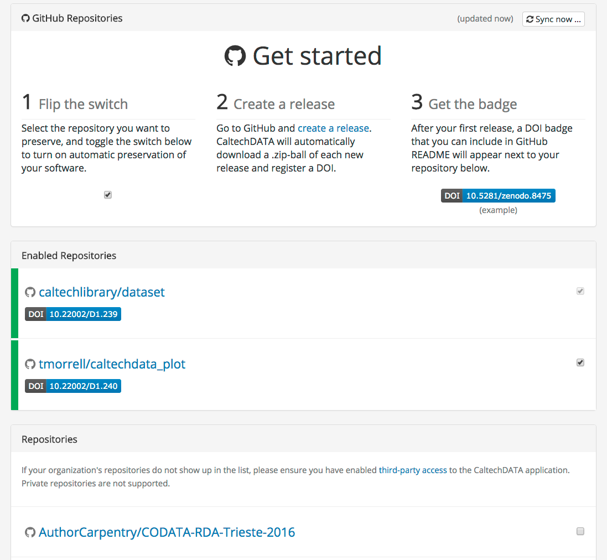
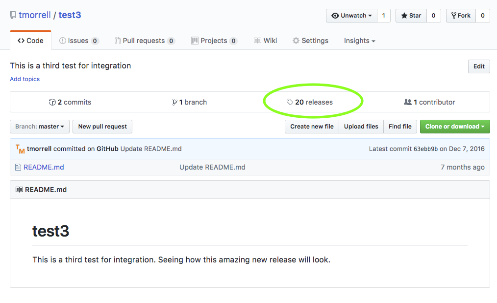
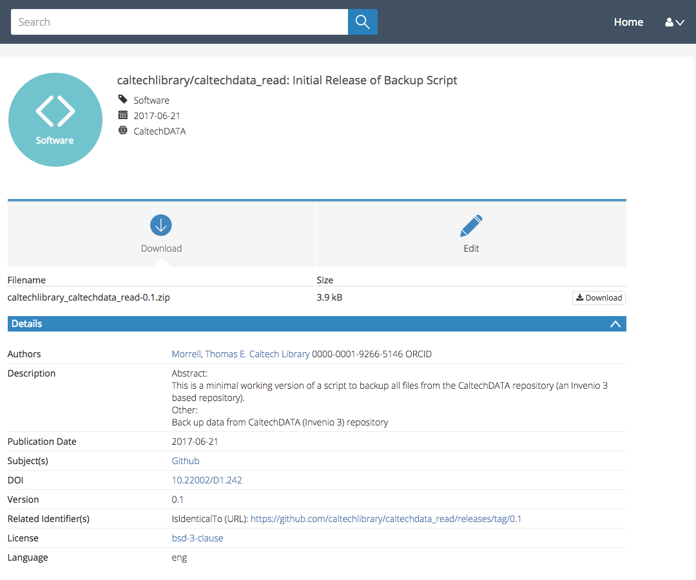

> The opposite of "open" isn't "closed".
> The opposite of "open" is "broken".
>
> --- John Wilbanks
{: .quotation}

Free sharing of information might be the ideal in science,
but the reality is often more complicated.
Normal practice today looks something like this:

*   A scientist collects some data and stores it on a machine
    that is occasionally backed up by her department.
*   She then writes or modifies a few small programs
    (which also reside on her machine)
    to analyze that data.
*   Once she has some results,
    she writes them up and submits her paper.
    She might include her data—a growing number of journals require this—but
    she probably doesn't include her code.
*   Time passes.
*   The journal sends her reviews written anonymously by a handful of other people in her field.
    She revises her paper to satisfy them,
    during which time she might also modify the scripts she wrote earlier,
    and resubmits.
*   More time passes.
*   The paper is eventually published.
    It might include a link to an online copy of her data,
    but the paper itself will be behind a paywall:
    only people who have personal or institutional access
    will be able to read it.

For a growing number of scientists,
though,
the process looks like this:

*   The data that the scientist collects is stored in an open access repository
    like [figshare](https://figshare.com/) or
    [Zenodo](https://zenodo.org), possibly as soon as it's collected,
    and given its own
    [Digital Object Identifier](https://en.wikipedia.org/wiki/Digital_object_identifier) (DOI).
    Or the data was already published and is stored in
    [Dryad](https://datadryad.org/).
*   The scientist creates a new repository on GitHub to hold her work.
*   As she does her analysis,
    she pushes changes to her scripts
    (and possibly some output files)
    to that repository.
    She also uses the repository for her paper;
    that repository is then the hub for collaboration with her colleagues.
*   When she's happy with the state of her paper,
    she posts a version to [arXiv](https://arxiv.org/)
    or some other preprint server
    to invite feedback from peers.
*   Based on that feedback,
    she may post several revisions
    before finally submitting her paper to a journal.
*   The published paper includes links to her preprint
    and to her code and data repositories,
    which  makes it much easier for other scientists
    to use her work as starting point for their own research.

This open model accelerates discovery:
the more open work is,
[the more widely it is cited and re-used](https://doi.org/10.1371/journal.pone.0000308).
However,
people who want to work this way need to make some decisions
about what exactly "open" means and how to do it. You can find more on the different aspects of Open Science in [this book](https://link.springer.com/book/10.1007/978-3-319-00026-8).

This is one of the (many) reasons we teach version control.
When used diligently,
it answers the "how" question
by acting as a shareable electronic lab notebook for computational work:

*   The conceptual stages of your work are documented, including who did
    what and when. Every step is stamped with an identifier (the commit ID)
    that is for most intents and purposes unique.
*   You can tie documentation of rationale, ideas, and other
    intellectual work directly to the changes that spring from them.
*   You can refer to what you used in your research to obtain your
    computational results in a way that is unique and recoverable.
*   With a distributed version control system such as Git, the version
    control repository is easy to archive for perpetuity, and contains
    the entire history.

## Code and Data Preservation

However, GitHub is a commercial service and makes no promises that your code
will be available in the future.  Anyone who has tried following web links in
old publications knows that it's very easy for URLs to break.  In order to
fulfill the promise of open science, you need to deposit your code in data in a
trusted repository - a web service that will ensure that your files are
available in the future. These repositories will provide a DOI, a permanent
and registered link that leads to your code or data. You should include this
DOI with your publications as the link location can be updated without breaking.

If your field has a domain-specific repository, this is a good place to store
your data.  You can find a good listing of subject-specific repositories at
[PLOS](https://journals.plos.org/plosone/s/data-availability#loc-recommended-repositories).  
A more complete list of repositories is available at
[re3data](https://www.re3data.org)

However, most code and a lot of data don't fit in an existing repository.  This
is where institutional repositories like [CaltechDATA] come
in.  We'll use CaltechDATA throughout the rest of this section, but non-Caltech
users can use [Zenodo](https://zenodo.org), which is similar. 

### Setting Up Automatic GitHub Preservation

Log into [CaltechDATA] by clicking the Login link in the
upper right-hand corner of the page.  You can click the "Caltech account" link
to log in with your Caltech IMSS username and password. Once you're logged in,
click on your profile (the little person icon in the upper right hand corner of
the page) and select GitHub.  By clicking the button and entering your GitHub
username and password you can connect your CaltechDATA account to GitHub.

You will now see a list of all the repositories you have access to.  In order
to turn on repository preservation, click the slider to the right of the repository
name. Nothing will happen just because you click the slider.  This only tells
CaltechDATA to watch the indicated repository for releases.

### Making Releases

Releases are a good way to organize your development process.  They're a way
for the scientific community to reference a specific version of your code and
ensures that everyone is talking about the same thing. There are lots of ways
to organize releases, but it's easiest to make a release every time someone
else might be interested in citing your code.  This could be when you're
preparing a publication or have finished a new feature.  

To make a release, go to GitHub and click the Releases text at the center-right
of your main repository page.  Then click the "Draft a new release" button on
the right-hand side of the screen. You'll need to provide a version number (use
something like v0.1 prior to publication, something like v1.2.1 for changes
after.  See more on [versioning](https://semver.org).)  You'll also need to
provide a title and description for your release.  

Once you click publish the magic happens!  CaltechDATA notices that you have
created a new release and automatically saves everything in your
repository.  It captures your code and files at the point of release, but does
not save the full history.  The release is automatically assigned a DOI, which
leads to a CaltechDATA landing page.  You'll see a download link for the files,
information about authors, the descriptions you wrote in GitHub, and a link
back to the GitHub repo.  You can edit the metadata for a record by clicking
the Edit button.  This is useful if you want to include more than one author,
ORCID identifiers, or more links.

   
You also get a badge (found on the GitHub page in CaltechDATA), that you can
include in your repository README file on GitHub.  This will update to the newest DOI if
you do additional releases.

## GitHub and Data

GitHub is great for sharing and collaborating on code, but it is not set up for
managing scientific data.  The maximum upload file size is 100 MB, and the
entire repository should be less than 1 GB.  An extension to git (LFS) supports
files up to 2 GB in size, but storing these files on GitHub is fairly expensive
($5 / month for 50 GB of storage).  It's better to store your data files on a
disciplinary or institutional data repository.  For an overview of uploading
data files to a repository, see this [AuthorCarpentry
lesson](https://authorcarpentry.github.io/dois-citation-data/01-register-doi.html)

[CaltechDATA]: https://data.caltech.edu/
